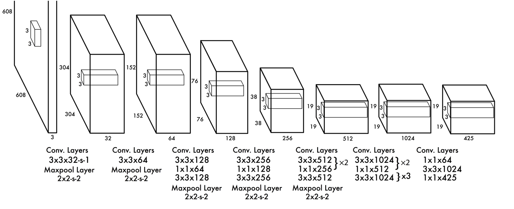
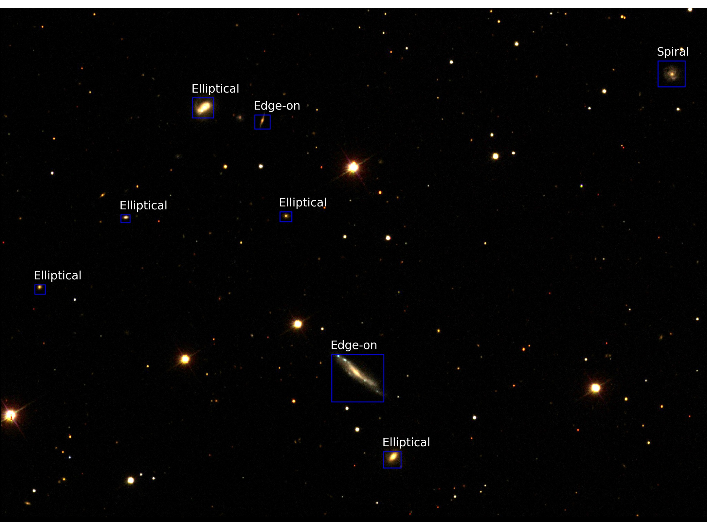

# Galaxy Detection and Classification in SDSS using deep learning

The examples show how to detect and classify galaxies in SDSS images using [YOLO](https://github.com/astroCV/darknet).
First example tests the detector with a local .jpg. Second one also tests on a local .jpg, but if said .jpg doesn't exist, it loads an image from the web. Third example tests the detector in images with different aspect ratios. Fourth example generates a .jpg from three .fits images, then applies different filters to the image (e.g. lupton, sqrt, log) and finally tests the detector in different filters for comparison.

Training was made using images from SDSS in r,g,i bands converted to RGB color scale using [make_lupton_rgb](http://docs.astropy.org/en/stable/api/astropy.visualization.make_lupton_rgb.html) method.
Galaxy classification was taken from [Galaxy Zoo](https://www.galaxyzoo.org/).
We train the network with nearly 20000 galaxies located in nearly 7000 SDSS images, with 5 classiffications: elliptical, spiral, edge-on, DK, merge.




## Trained AstroCV Networks

Download trained network from [Here (200Mb)](https://drive.google.com/file/d/0B8RHInq4tQDvTTliOEt0SFViWDg/view?usp=sharing) for Lupton i,r,g -> RGB images

This other network from [Here](https://drive.google.com/file/d/0B8RHInq4tQDvYkN5MFV0S2VTV1U/view?usp=sharing) trained for high contrast or saturated RGB images such as HST deep field images.


## Requeriments, install and run

For detailed installing instructions, check the installation_guide.md file in the main AstroCV folder

To check examples, run them on jupyter notebook.



## Train your own Dataset

In training folder you will find the scripts to generate the training data for DARKNET for 5 classes. A custom number of classes need to change scripts and configuration files(detailed tutorial coming soon!)

All scripts assume the .py is located in /mnt/data3/sdss . This is the path of these scripts in our local computer, change it accordingly.

You can use as configuration files sdss.data and sdss.cfg, located in the /data folder.

In sdss.data you need to specify paths to the train and val text files which have the paths for all images and labels respectively. Paths are relative to darknet path. In backup, set the path where the training weights will be saved.

In names, sdss.names includes in each line the name of the different classes. The first line will be class 0 (according to the darknet label format), the second line will be class 1 and so on.

In sdss.cfg you can configure different CNN parameters. In \[region\] you need to change the classes number if you add or remove classes.

Note that, since data is obtained from SDSS, you can’t add a priori a lot of extra classes. You can check all classes available in the SDSS table [here](https://skyserver.sdss.org/dr12/en/help/browser/browser.aspx#&&history=description+zooSpec+U)

You need a base .weights file to start traning. Download the pretrained starting running in a terminal

```
$ wget https://pjreddie.com/media/files/darknet19_448.conv.23
```

Now that every file is configured, open a terminal in the darknet folder.

To begin the training using two GPU cards you can use a command like:
```
$ ./darknet detector train cfg/sdss.data cfg/yolo.cfg darknet19_448.conv.23 -gpus 0,1
```

If you need to stop the traning, you can resume it running in a terminal in the darknet folder a command like:
```
$ ./darknet detector train cfg/sdss.data cfg/yolo.cfg result/yolo.backup -gpus 0,1
```
To recall a .weights file to test it and check IOU and recall, run in a terminal in the darknet folder something like:
```
$ ./darknet detector recall cfg/sdss.data cfg/yolo.cfg result/yolo_400.weights -gpus 0,1
```
This example is testing the weights obtained after 400 iterations


Test on a single image:
```
$ ./darknet detector test cfg/sdss.data cfg/yolo.cfg result/yolo_400.weights image.jpg
```
Basically, the syntax is 
```
$ ./darknet detector \*action \*path/to/.data \*path/to/.cfh \*path/to/weights -gpus \*gpus to use
```
Using nearly 20000 galaxies we stopped training around 20000 iterations, and notice best convergence around 15000 iterations. However, for a custom dataset the only way to check convergence is compute the recall ration for different iterations.
