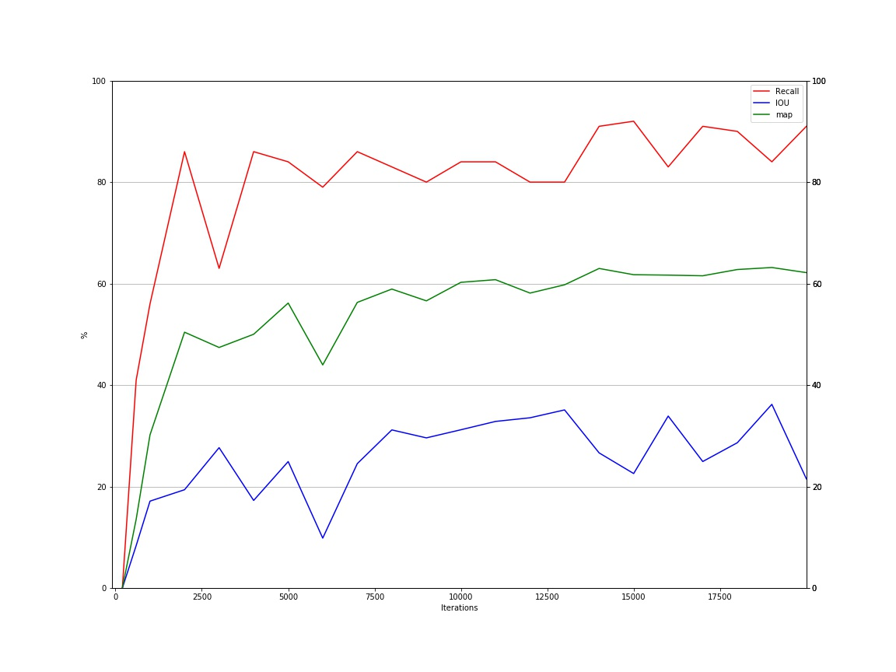

# astroCV yolo v3
## Comparison with yolo v2

Here you can compare a detection for the same image (obtained from google images, not from training set) for the same threshold (0.1) using yolov2 (above) and yolov3 (below).

The weights used for both detections were obtained after 14000 iterations

As you can see, yolov3 detects more galaxies and the bounding boxes are better aligned.

And here is a graph that shows the map, IoU and recall for different iterations for this training.

